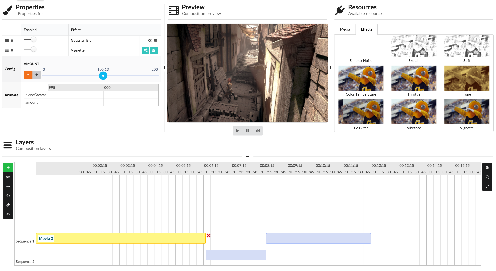

# Lowkey video editor
## Goal
The goal of the project is build a web based video compositor. Leveraging the latest in web technologies and with the help of the seriously.js library, we want to build a web editor that can load input videos, do video scrubbing, add various effects to the video inputs, be able to toogle effects on or off, change the order in which the effects are applied, be able to remove effects, be able to animate effects over time using keyframes, and being able to animate the properties by setting keyframes at different points in time.
## Motivation
For a very long time, we have seen web technologies struggle to process and consume real time video data feeds. However, with advancements in the engines of browsers, JavaScript, and easy to use libraries that can process video (seriously.js), we wanted to build a video editor. We knew this had a lot of moving parts but after seeing video web editors on the web and having a good understanding in web programming, we wanted to take on the challenge to build one ourselves. 
## Prerequisites
[grunt](https://github.com/gruntjs/grunt) and [bower](https://github.com/bower/bower) should already be installed
## Quick Start
* `git clone https://github.com/genu/lowkey`
* `cd lowkey`
* `npm install`
* `grunt server`

## What's in the box
The basic bower components that are included with the projects are listed here. The only reason that these are include is to demonstrate the idea behind the architecture; they can be removed or replaced as needed.
* angular#1.4.1
* angular-ui-router
* angular-bootstrap
* font-awesome
* bootstrap#3.3.4

## Application architecture
```
src/
├── js/
│   ├── app.js (Most of the application entry point code would go here)
│   ├── environment.js (Generated automatically by grunt based on project configuration)
├── modules/
│   ├── core/
│   │   ├── config/
│   │   │   ├── core.config.js (Entry point for the module)
│   │   │   ├── core.routes.js (Routes for this module)
│   │   ├── controllers/ (controller for each route)
│   │   │   ├── about.ctrl.js
│   │   │   ├── architecture.ctrl.js
│   │   │   ├── home.ctrl.js
│   │   │   ├── layout.ctrl.js
│   │   │   ├── main.ctrl.js
│   │   ├── views/ (templates)
│   │   │   ├── about.html
│   │   │   ├── app.html
│   │   │   ├── architecture.html
│   │   │   ├── home.html
│   ├── app.core.js (Main module definition)
```

## License
Licensed under the MIT License
